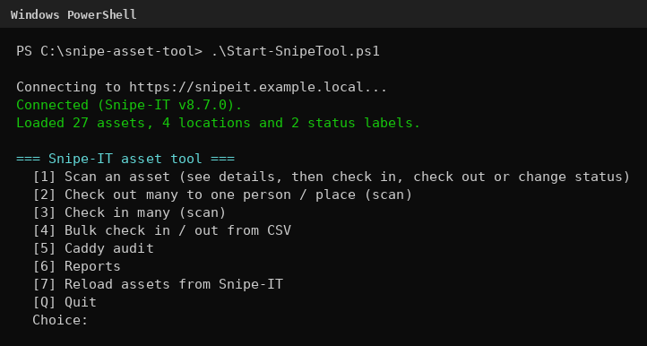
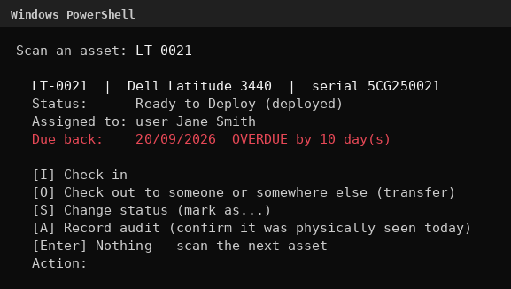
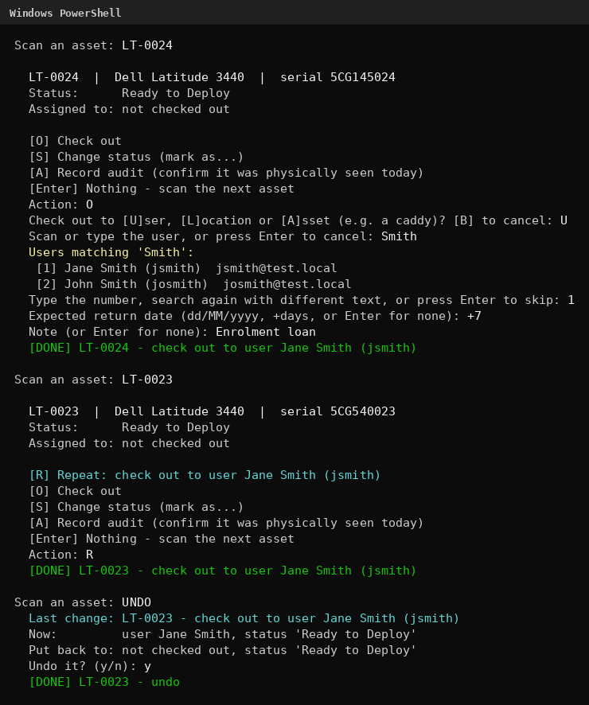
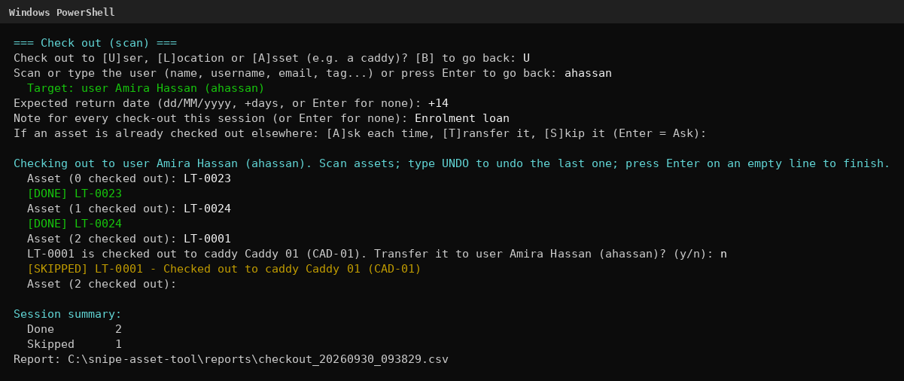
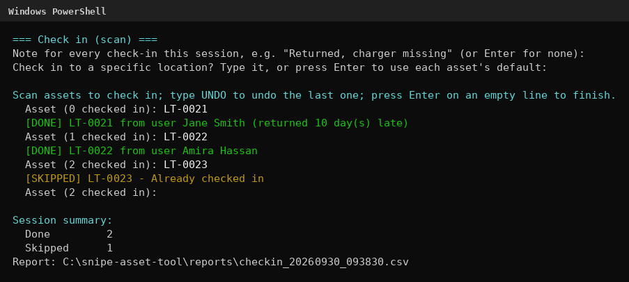
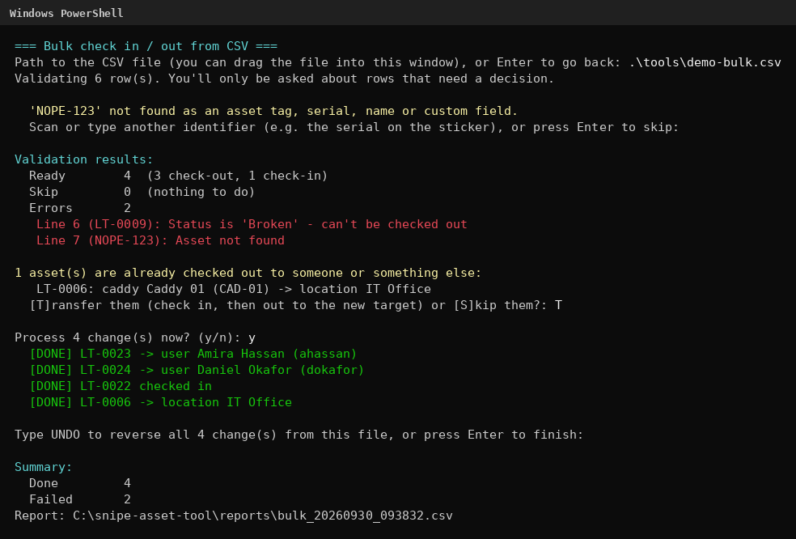
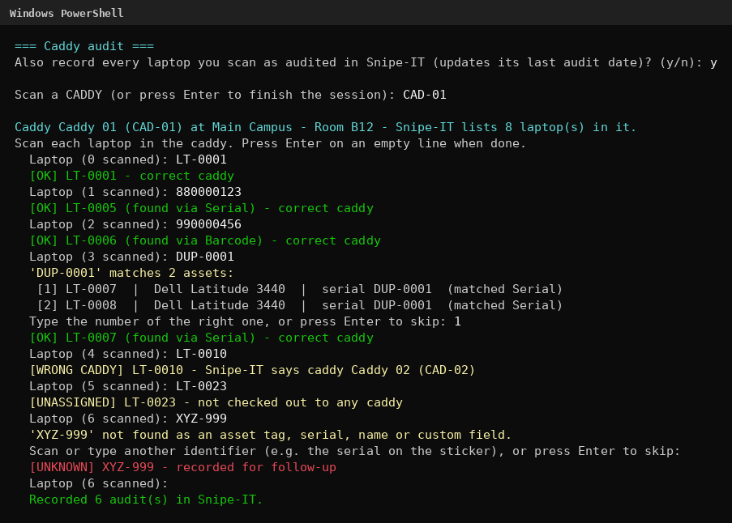
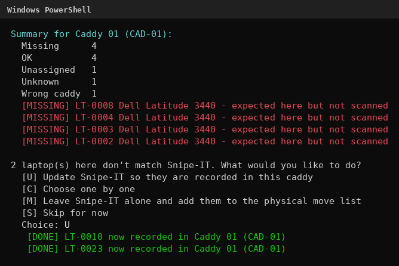
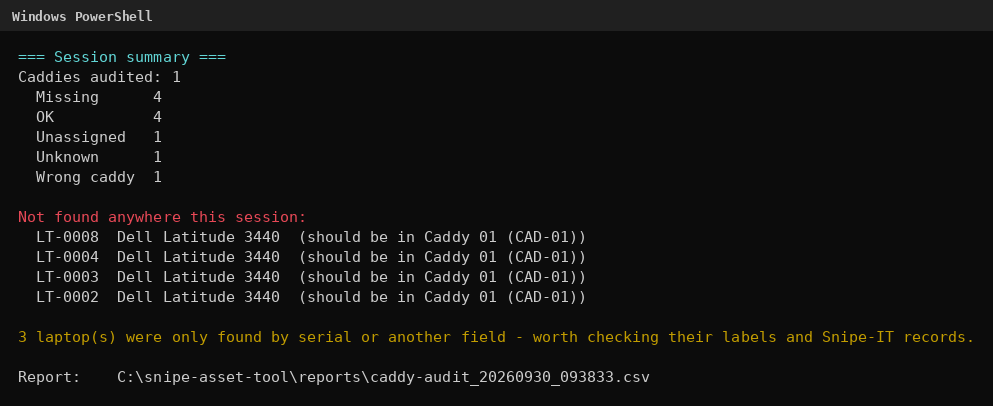
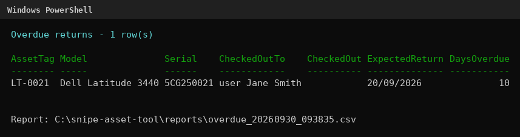

# Snipe-IT Asset Tool: User Guide

This guide shows you how to use the tool day to day. The screenshots were taken using sample test data.

**Contents**

1. [Before you start](#before-you-start)
2. [Starting the tool](#starting-the-tool)
3. [Getting around](#getting-around)
4. [How scanning works](#how-scanning-works)
5. [Scan an asset](#1-scan-an-asset)
6. [Check out many](#2-check-out-many)
7. [Check in many](#3-check-in-many)
8. [Bulk check in / out from CSV](#4-bulk-check-in--out-from-csv)
9. [Caddy audit](#5-caddy-audit)
10. [Reports](#6-reports)
11. [Undo](#undo)
12. [Troubleshooting](#troubleshooting)

---

## Before you start

You need:

- **A Windows PC** with PowerShell (built into Windows)
- **A Snipe-IT account with API access**, and an API key. In Snipe-IT, click your name (top right) → **Manage API Keys** → **Create New Token**, and copy the key straight away, as it's only shown once. If you can't see Manage API Keys, ask your Snipe-IT administrator for API permission.
- **Permission to use the tool** from whoever manages your Snipe-IT

### One-time setup

1. **Extract the tool** somewhere easy to find, e.g. your Documents folder.
2. **Set your Snipe-IT address:** open `config\settings.json` in Notepad and change `SnipeUrl` to your Snipe-IT's address (for example `https://snipeit.example.local`). Save it.
3. **Unblock the files:** Windows blocks downloaded scripts until you say you trust them. Open PowerShell and run these two lines, one at a time:
   ```powershell
   cd "$HOME\Documents\snipe-asset-tool"
   Get-ChildItem -Recurse | Unblock-File
   ```
4. **If you see "running scripts is disabled"**, your PC's execution policy is blocking scripts. On a work PC, ask IT to allow it. On your own PC, you can run `Set-ExecutionPolicy -Scope CurrentUser RemoteSigned`.

The first time you run the tool, it asks for your API key. Paste it with **Ctrl+V** or right-click and press Enter. **Nothing appears as you paste**, which is normal, since it's hidden like a password. It's stored encrypted, so only your Windows account on this PC can use it.

---

## Starting the tool

Open PowerShell, go to the tool's folder, and start it:

```powershell
cd "$HOME\Documents\snipe-asset-tool"
.\Start-SnipeTool.ps1
```

It connects to Snipe-IT, loads your assets, and shows the main menu. Type a number and press Enter.



### Practice mode

**If you're new to the tool, start in practice mode:**

```powershell
.\Start-SnipeTool.ps1 -WhatIf
```

Everything works as normal, including looking up live data from Snipe-IT, but **nothing is changed**. Instead of `[DONE]`, you'll see `[WHATIF]` lines saying what would have happened.

---

## Getting around

| To... | Do this |
|---|---|
| Finish a list of scans, or go back a step | Press **Enter on an empty line** |
| Go back, where offered | Type **B** |
| Undo the last change | Type **UNDO** at any scan prompt |
| Quit | Type **Q** at the main menu |
| Stop immediately | Press **Ctrl + C** |

**What the results mean:**

| Result | Colour | Meaning |
|---|---|---|
| `[DONE]` | Green | The change was made in Snipe-IT |
| `[WHATIF]` | Purple | Practice mode: this is what would have happened |
| `[SKIPPED]` | Yellow | Nothing needed doing, e.g. it was already checked in |
| `[FAILED]` | Red | The change couldn't be made. The reason is shown after it |

---

## How scanning works

Wherever the tool asks you to scan an asset, you can use a **barcode scanner** or **type** it. A USB barcode scanner acts like a keyboard that types the code and presses Enter, so you can scan asset after asset without touching the keyboard.

Barcodes aren't always stored in the same place in Snipe-IT, so the tool checks, in this order:

1. The **asset tag**
2. The **serial number**
3. The asset's **name** and **custom fields**

When an asset is found somewhere other than its asset tag, the tool tells you (e.g. "found via Serial").

It **never guesses**:
- **If a code matches more than one asset** (e.g. two laptops with the same serial), it lists them and asks you to pick.
- **If nothing matches**, it shows similar assets and asks you to scan or type something else, such as the serial number on the laptop's sticker. Press Enter to skip.

People can be found by **name, username, email or employee number**. If more than one person matches (e.g. two people called Smith), you pick from a list.

---

## 1. Scan an asset

**Use it for:** everyday desk work, one asset at a time, when you want to see an asset's details before deciding what to do.

1. Choose **1** from the main menu.
2. Scan an asset. The tool shows its details: model, serial, status, who or where it's checked out to, and when it's due back. Overdue loans are highlighted in red.
3. Choose what to do. The options change depending on the asset:



| Option | What it does |
|---|---|
| **R** | Repeats your last action on this asset (only shown after your first action) |
| **I** | Checks it in. You can add a note, choose a location, and change its status at the same time (e.g. check in and mark as Broken) |
| **O** | Checks it out to a user, location or another asset such as a caddy. If it's already checked out, this transfers it |
| **S** | Changes its status, e.g. Ready to Deploy, Broken or Disposed |
| **A** | Records an audit, confirming it was physically seen today |
| **Enter** | Does nothing, ready for the next scan |

### Working through a batch with R

After your first action, **R** repeats it with the same person, date and note. For example, to lend several laptops to the same person, check out the first one normally, then just press **R** for each of the rest.



### About statuses

- **"Deployed" isn't a status you set.** Snipe-IT shows an asset as deployed automatically while it's checked out.
- **Statuses that mean "not usable"** (like Broken or Disposed) can't stay checked out. If you choose one for a checked-out asset, the tool asks, then checks it in first.

---

## 2. Check out many

**Use it for:** checking out lots of assets to the **same** person, location or caddy, such as filling a caddy or lending several laptops to one member of staff.

1. Choose **2** from the main menu.
2. Choose **U** (user), **L** (location) or **A** (asset, e.g. a caddy), then scan or type who or where.
3. Optionally, enter an **expected return date** and a **note**. These apply to every asset in the session. Dates can be written as `19/12/2026` or `+14` (14 days from today).
4. Choose what to do if an asset is **already checked out** to someone else: ask each time, always transfer, or always skip.
5. Scan assets one after another. Press **Enter on an empty line** when done.



---

## 3. Check in many

**Use it for:** returns, such as a pile of laptops handed back at the end of term.

1. Choose **3** from the main menu.
2. Optionally, enter a **note** for all check-ins (e.g. "Returned, charger missing") and a **location** to check them in to.
3. Scan assets one after another. **Late returns are flagged** with how many days late they are.
4. Press **Enter on an empty line** when done.



---

## 4. Bulk check in / out from CSV

**Use it for:** large jobs where each asset goes to a **different** person or place, such as enrolment loans.

### Preparing the spreadsheet

Copy `templates\bulk-template.csv` and fill it in, in Excel or Notepad. Keep the first row (the column names) as it is. Save it as **CSV**.

| Column | Required | What to put |
|---|---|---|
| `Identifier` | Yes | Asset tag, serial or barcode |
| `Action` | Yes | `Checkout` or `Checkin` |
| `AssignTo` | For check-outs | Username, email, name, location name or caddy tag |
| `AssignType` | No | `User`, `Location` or `Asset`. Blank means User |
| `ExpectedCheckin` | No | `19/12/2026` or `+14` |
| `Notes` | No | Added to the asset's history |

### Running it

1. Choose **4** from the main menu.
2. Type the path to your CSV file, or **drag the file into the PowerShell window**, and press Enter.
3. **The tool checks every row before changing anything.** It lists any problems, such as assets or people it can't find, broken assets and bad dates. It only stops to ask you about rows that need a decision.
4. If some assets are already checked out to someone else, choose whether to **transfer** or **skip** them.
5. Confirm with **y** to make the changes. Rows with problems are skipped.
6. Afterwards, you can type **UNDO** to reverse the whole batch.



---

## 5. Caddy audit

**Use it for:** checking that what's physically in each laptop caddy matches Snipe-IT, and fixing it when it doesn't.

1. Choose **5** from the main menu.
2. Choose whether to **record audits** in Snipe-IT. If you say yes, every laptop you scan is marked as seen today.
3. **Scan the caddy.** The tool tells you how many laptops Snipe-IT thinks are in it.
4. **Scan every laptop that's physically in the caddy.** Each one is checked straight away:

| Result | Meaning |
|---|---|
| `[OK]` | Recorded in this caddy |
| `[WRONG CADDY]` | Recorded in a different caddy |
| `[LOANED]` | Checked out to a person or location |
| `[UNASSIGNED]` | Not checked out to anything |
| `[UNKNOWN]` | Not found in Snipe-IT, recorded for follow-up |



5. **Press Enter on an empty line** when you've scanned everything. Laptops that Snipe-IT expected but you didn't scan are listed as **missing**.
6. **Choose what to do about mismatches:**
   - **U:** update Snipe-IT so they're recorded in this caddy
   - **C:** choose one by one
   - **M:** leave Snipe-IT as it is and add them to a physical **move list** instead
   - **S:** skip for now

   Laptops on loan to a person are only moved after you confirm, since that ends the loan. Broken or non-deployable laptops are flagged but never changed.



7. **Scan the next caddy**, or press **Enter on an empty line** to finish. At the end, laptops "missing" from one caddy that turned up in another are matched up, so the summary only lists laptops that weren't found anywhere.



---

## 6. Reports

1. Choose **6** from the main menu. The tool refreshes its data from Snipe-IT first.
2. Choose a report:

| Report | Shows |
|---|---|
| **1** | Everything checked out to people |
| **2** | Overdue returns, most overdue first |
| **3** | Everything one person has |
| **4** | What Snipe-IT says is in each caddy |

3. Type **B** to go back to the main menu.



### Report files

Every mode saves a CSV report of what it did to the `reports` folder, which you can open in Excel. **Reports contain names and usernames**, so treat them as personal data: keep them on your work PC or an approved location, don't email them around, and delete them when you no longer need them.

---

## Undo

Type **UNDO** at any scan prompt to reverse the most recent change. The tool shows what the asset is like now and what it'll be put back to, and asks before doing anything. Type it again to keep going back through earlier changes.

After a CSV run, you can type **UNDO** to reverse the whole batch.

Undo restores who or where an asset was with, and its status. A return date that has already passed isn't restored.

---

## Troubleshooting

| Problem | What to do |
|---|---|
| "Running scripts is disabled on this system" | Your PC's execution policy is blocking scripts. On a work PC, ask IT. See [One-time setup](#one-time-setup) |
| "Snipe-IT rejected the API key (401)" | The saved key is wrong or has been revoked. Create a new key in Snipe-IT, then run `.\Start-SnipeTool.ps1 -ResetApiKey` |
| "Couldn't connect to Snipe-IT" | Check `SnipeUrl` in `config\settings.json`, and that you can open Snipe-IT in your browser |
| Certificate or SSL errors | Your PC may not trust your Snipe-IT server's certificate. Ask IT; only set `SkipCertificateCheck` to `true` if they say that's acceptable |
| An asset you know exists isn't found | It may have been added since the tool started. Choose **7** from the main menu to reload assets |
| "Snipe-IT rate limit reached" | Snipe-IT limits how fast requests can be made. The tool waits and retries automatically |
| "This Snipe-IT version does not support recording audits" | Your Snipe-IT version can't record audits through the API. Everything else still works |
| Something unexpected | Press Ctrl+C to stop. Changes already made stay made, and are listed in the report and in each asset's history in Snipe-IT |
